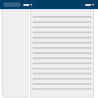

## Layouts
Consistent and anticipated layouts allow users to navigate and understand applications with more ease. These layout and content types cover most use-cases for standard web applications.

#### Layout types

##### Fluid

[View example](layouts/fluid.html){:target="_blank"}

The fluid page layout provides maximum space for content in all sizes. It leaves control over the size of the interface to the user by automatically adjusting to fit the size of their browser. Note that some types of content (like large bodies of text) can become hard to read due to excessively long line lengths, if nothing is done to mitigate this.

Equal padding should be observed left and right of the page content. At no point should text fall behind a browser scroll bar.
{: .clearfix}

##### Hybrid

[View example](layouts/hybrid.html){:target="_blank"}

The hybrid page layout combines the fluid design for the application header with a fixed width design for the rest of the content area. It should only be used in cases where a fixed width page layout is desirable but where the Application header might contain a large number of items.
{: .clearfix}

#### Content types

##### Content only

[View example](layouts/type-content-only.html){:target="_blank"}

The content only layout maximizes the space available for content. It provides more horizontal space than the other layouts, and is therefore ideal for displaying wide tables and other large user interface elements. Conversely, it doesn't provide any structure for grouping and separating elements.
{: .clearfix}

##### Navigation and content

[View example](layouts/type-content-navigation.html){:target="_blank"}

The navigation and content layout has a column for vertical navigation to the left of the content area, which is useful for when a long list of navigation links is necessary.

*** See Vertical navigation and Horizontal navigation for more detail.
{: .clearfix}

